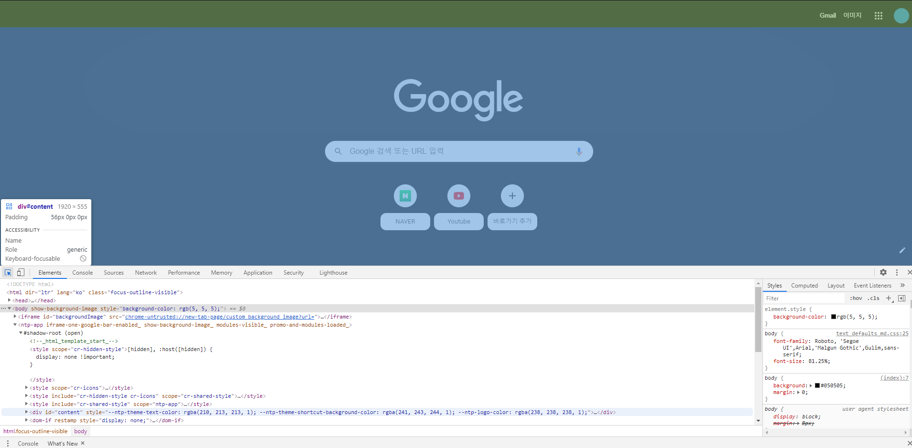
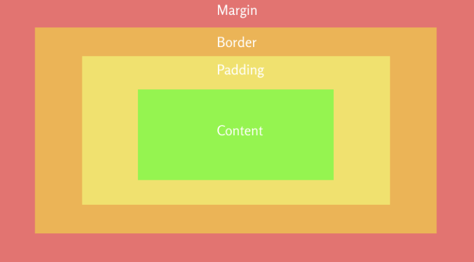
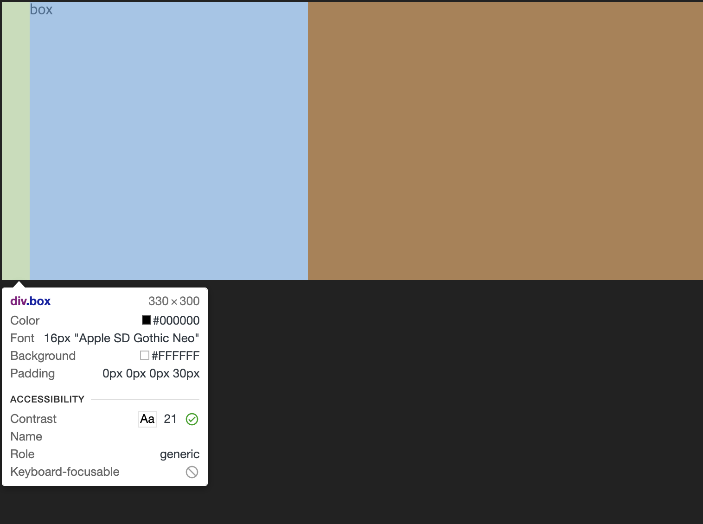
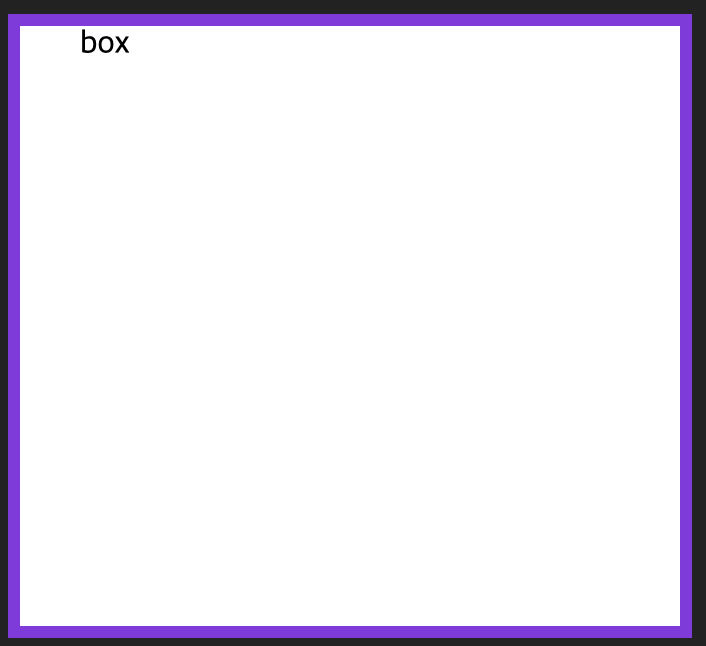
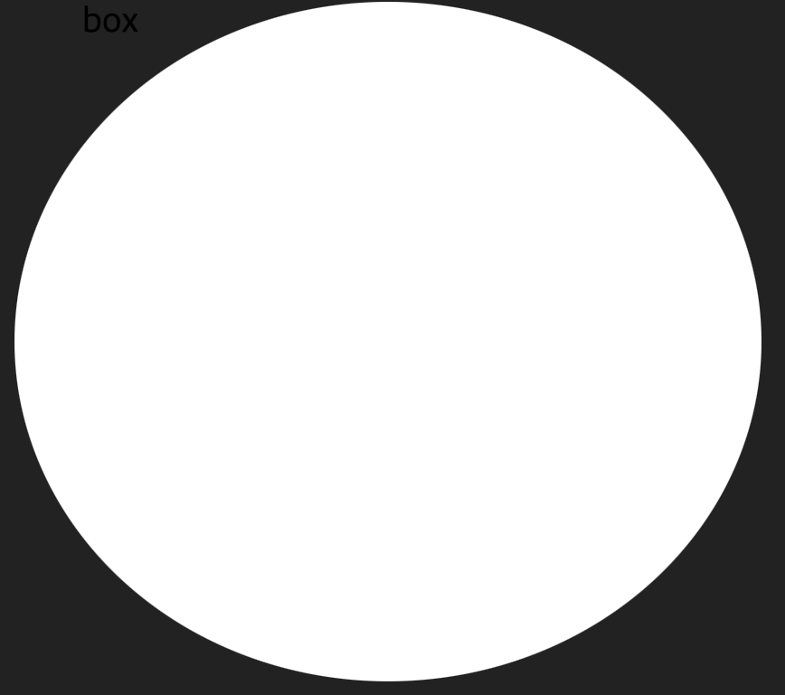
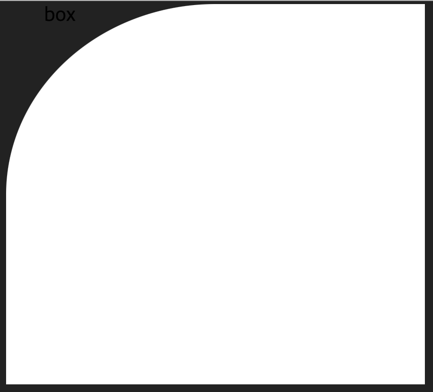
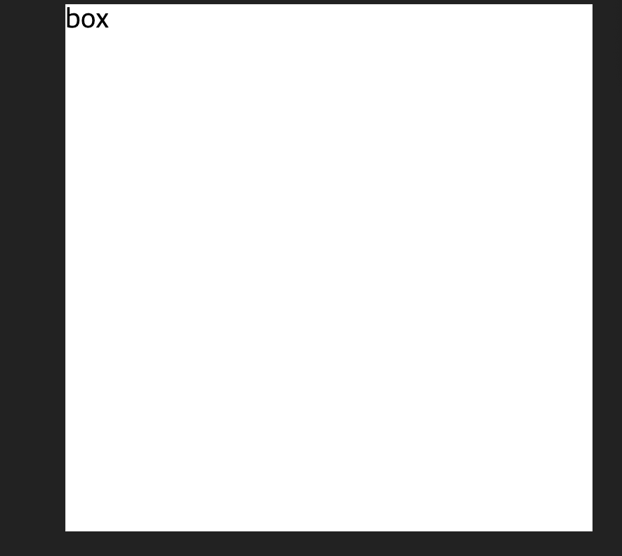
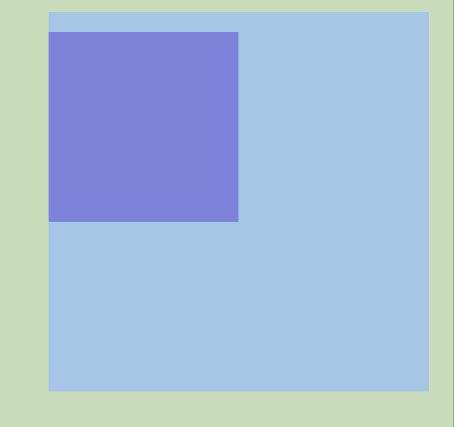
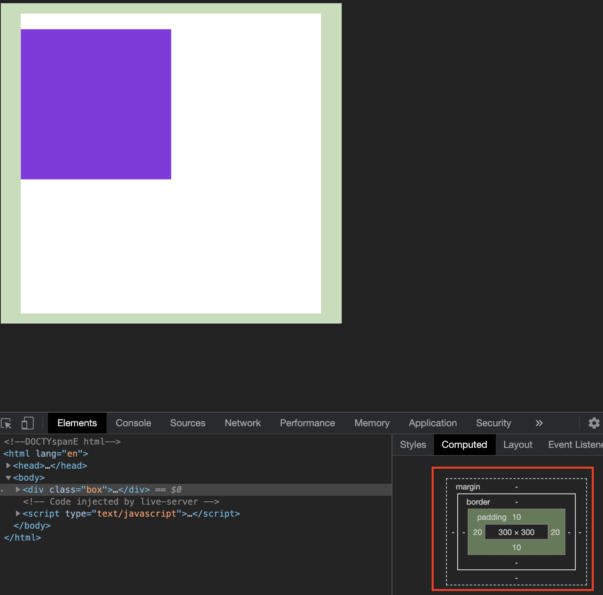
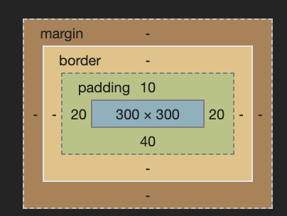

## CSS 박스모델
<br/>
width, height, padding, border, margin

html 문서는 박스 형태로 되어있습니다

확인해봅시다(인터넷 창 - F12 - 컨트롤+쉬프트+C)

<br/>
박스가 일정한 형태로 모델이 구성되기 때문에 박스 모델로 불립니다<br/>

<br/>
content - 이 박스에 가로가 width, 세로는 height를 담당합니다

padding - content와 border 사이에 안쪽 여백 공간을 표현하는 것을 일컫습니다 테두리사이 공간을 주는 것.

css에 padding:top 20px를 작성하면 content 기준으로 위로 20px 밀려나게 됩니다

border - 테두리를 나타냅니다 어떤 테두리가 원하는지 알려줘야합니다 (굵기, 스타일, 색상) 등

예) 1px solid #222

margin - 바깥 쪽 여백을 뜻하며 요소와 요소 사이의 간격을 나타냅니다

index.html

```html
<div class="box">
      box
</div>
```

style.css

```css
body {
    background-color: #222;
}

.box {
    width: 300px;
    height: 300px;
    background-color: #fff;
}
```

.box 에 padding-left: 30px; 를 넣어주세요

```css
.box {
    width: 300px;
    height: 300px;
    background-color: #fff;
    **padding-left: 30px;**
}
```

컨트롤+쉬프트+c 단축키를 이용하여 padding-left가 제대로 작성되었는지 확인해봅니다

연두색 박스 부분이 padding-left가 적용된 모습입니다 우리가 작성한 흰색 박스가 왼쪽으로부터 30px 밀려난게 보이죠?

다음은 border를 적용해보겠습니다 먼저 굵기를 정해야하고 색상과 테두리를 지정해주지 않으면 결과값이 정확히 나오지 않습니다

```css
.box {
    width: 300px;
    height: 300px;
    background-color: #fff;
    padding-left: 30px;
    border: 6px solid blueviolet;
}
```

border값을 적용했습니다 여기서 solid 는 전체 테두리를 감쌉니다

- 여러가지 border를 적용했습니다(여기는 따라하지 않고 코드만 복사 붙여넣어서 확인해보세요)

    index.html

    ```html
    <html lang="en">
        <head>
            <meta charset="UTF-8" />
            <meta name="viewspanort" content="width=device-width, initial-scale=1.0" />
            <title>CSS</title>
            <link rel="stylesheet" href="./style.css" />
        </head>
        <body>
            <div class="card card-1"></div>
            <div class="card card-2"></div>
            <div class="card card-3"></div>
            <div class="card card-4"></div>
            <div class="card card-5"></div>
            <div class="card card-6"></div>
            <div class="card card-7"></div>
            <div class="card card-8"></div>
            <div class="card card-9"></div>
            <div class="card card-10"></div>
        </body>
    </html>
    ```

    style.css

    ```css
    body {
        background: #e2e1e0;
        text-align: center;
    }

    .card {
        background: #fff;
        border-radius: 2px;
        display: inline-block;
        height: 100px;
        margin: 1rem;
        position: relative;
        width: 300px;
    }
    /* 단선(실선)으로 표시 */
    .card-1 {
        border: 5px solid #f0f;
    }
    /* 파선으로 표시 */
    .card-2 {
        border: 5px dashed #f0f;
    }
    /* 복선(이중선)으로표시 */
    .card-3 {
        border: 5px double #f0f;
    }
    /* 튀어 나와 보이는(돌출)로 표시 */
    .card-4 {
        border: 5px ridge #f0f;
    }
    /* 들어가 보이도록 표시 */
    .card-5 {
        border: 5px groove #f0f;
    }
    /* 보더 안쪽이 움푹 패여 보이게 표시 */
    .card-6 {
        border: 5px inset #f0f;
    }
    /* 보더 안쪽이 튀어 나와 보이게 블록형으로 표시 */
    .card-7 {
        border: 5px outset #f0f;
    }
    /* 점선으로 표시 */
    .card-8 {
        border: 5px dotted #f0f;
    }
    /* 표시하지않음 (경계가 겹치는 경우에 우선) */
    .card-9 {
        border: 5px hidden #f0f;
    }
    /* (표시하지 않음) */
    .card-10 {
        border: 5px none;
    }
    ```

border-radius는 테두리를 깍을 수 있는 속성입니다

```css
.box {
    width: 300px;
    height: 300px;
    background-color: #fff;
    padding-left: 30px;
    border-radius: 50%;
}
```

가장자리 한 부분만 깍고 있을 땐 이렇게 작성합니다

```css
border-top-left-radius: 50%;
```

margin 값을 넣어봅시다

```css
.box {
    margin-left: 30px;
    width: 300px;
    height: 300px;
    background-color: #fff;
}
```

.box에 margin-left 30px를 적용하게되면 body로부터 box를 30px 만큼 여백을 주겠다는 뜻입니다

*속기형 작성법에 대해 알려드리겠습니다

빠르게 쓰기 라는 형식입니다

전체 여백을 줄 때 각 다른 값을 넣을 땐 이렇게 작성합니다

index.html

p 태그를 추가 생성해주세요

```html
<body>
        <div class="box">
           <p></p>
        </div>
    </body>
```

style.css

p 태그에 대한 속성을 추가하고 .box에 padding 값을 확인해보세요

padding 뿐만 아니라 margin도 똑같습니다 

10px(top) 20px(right) 30px(bottom) 40px(left) 시계 방향 순서입니다

```css
body {
    background-color: #222;
}

.box {
    width: 300px;
    height: 300px;
    background-color: #fff;
    padding: 10px 20px 30px 40px;
}

p {
    background-color: blueviolet;
    width: 150px;
    height: 150px;
}
```

여기서 margin 10px 20px 지정

시계 방향이니까 10px(top) 20px(right) 0px(bottom) 0px(left)으로 지정

만약 left, right는 제외한 top bottom은 10px,  left right는 20px 적용하고싶다면 이렇게 적용

```css
padding: 10px 20px;
```

조금 더 응용해봅시다

top bottom은 각각 10px 40px를 적용하고 left, right은 20px로 적용 해봅시다

```css
padding: 10px 20px 40px;
```

top - right - bottom - left 기준으로 봤을 때 10px과 40px은 top , bottom 제대로 적용된게 맞고

20px은 left, right 서로 합쳐진다고 하였으니 정상적으로 값이 적용된게 맞습니다
