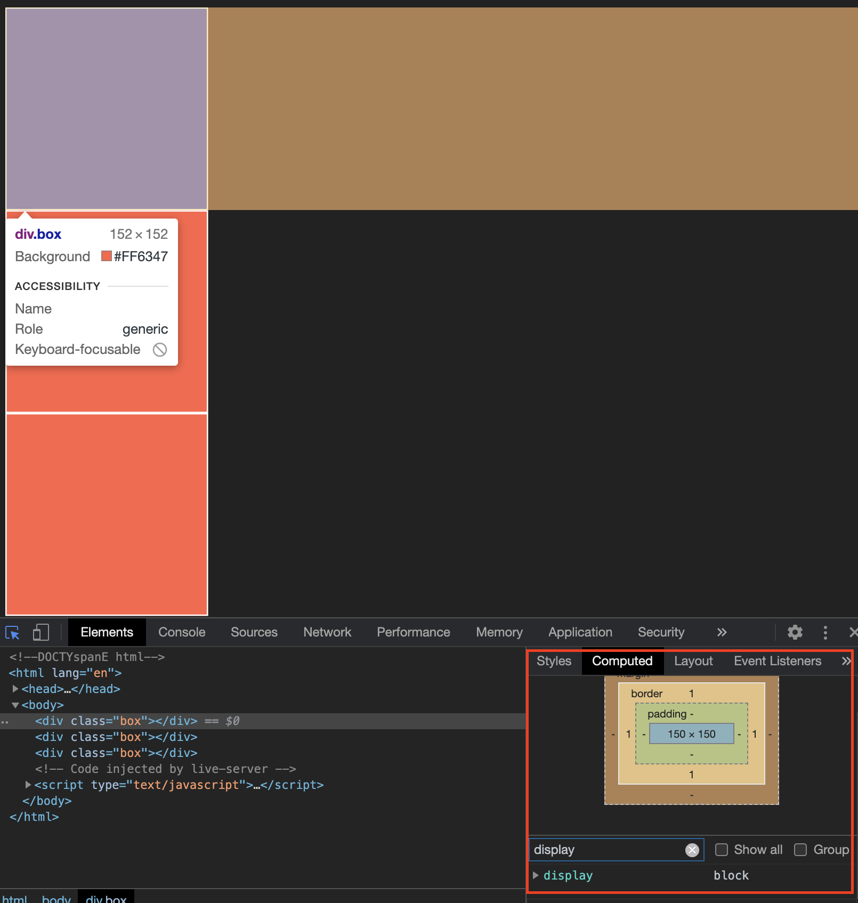

## block
<br/>

모든 요소는 디스플레이 값을 가지고 있습니다 디스플레이는 값이 무엇이냐에 따라 박스 타입이 달라집니다

display 속성에 block이 있습니다

block의 성질은 길을 막다 라는 느낌을 가지고 있습니다 내 옆에 공간이 존재해도 display:block를 지정하면 내 옆 공간에 침범할 수 없도록 되어있습니다

index.html

```html
<body>
        <div class="box"></div>
        <div class="box"></div>
        <div class="box"></div>
    </body>
```

style.css

```css
* {
    background-color: #222;
}

.box {
    width: 150px;
    height: 150px;
    background-color: tomato;
    border: 1px solid #ffffff;
}
```



block은 남은 비공간에 자동으로 margin 값이 채워지면서 자기 영역을 지키고 올라오지 못하게합니다