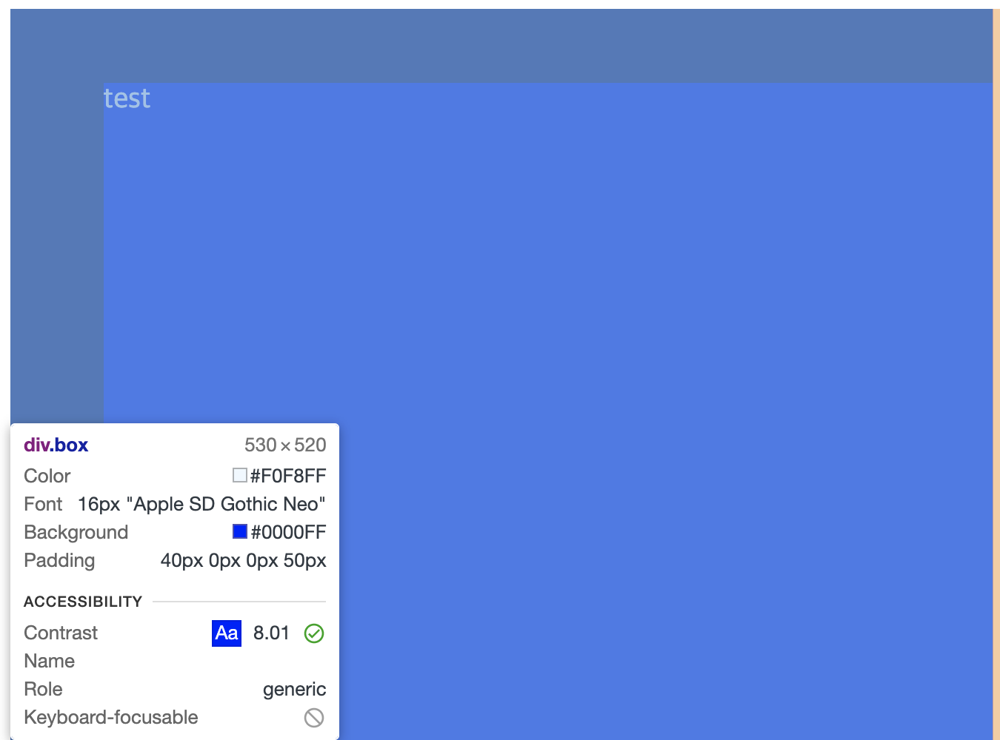
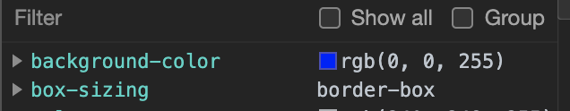

## box-sizing
<br/>

box-sizing은 박스의 크기를 화면에 표시하는 방식을 변경하는 속성입니다

index.html

```html
<body>
        <div class="box">
            test
        </div>
    </body>
```

style.css

```css
.box {
    width: 480px;
    height: 480px;
    background-color: blue;
    padding-top: 40px;
    padding-left: 50px;
    color: aliceblue;
}
```

현재 박스 값은 width 530 , height 520입니다



우리가 지정한 값은 width 480, height 480인데 왜 이렇게 표현이 될까요?

그것은 바로 크롬 웹사이트에는 지정한 padding값 까지 계산하기 때문입니다 우린 프로니까 당황하지 말고 지정할 값 까지 같이 계산하여 width, height에 적어주도록 합시다

box-sizing

기본적인 모든 요소들은 content-box로 설정되어있습니다

처음 html,head,body 모두 content-box로 지정되어있습니다

박스값이 content-box로 설정되어 있다는 것은 어떤 의미일까요? width와 height값을 적용하면 그 값을 content만의 width와 height로 설정되어 있다고 할 수 있습니다 보통은 border값까지 적용된 줄 알지만 사실상은 content박스 안에만 값이 들어간 것이라고 할 수 있습니다

border 까지 값을 지정하여 확장을 하고 지정한 값을 적용하고 싶다면?

```css
box-sizing: border-box;
```

content 값이 border-box로 변경되었습니다

F12 - 오른쪽 아래 Computed 클릭해보면 확인이 가능합니다

