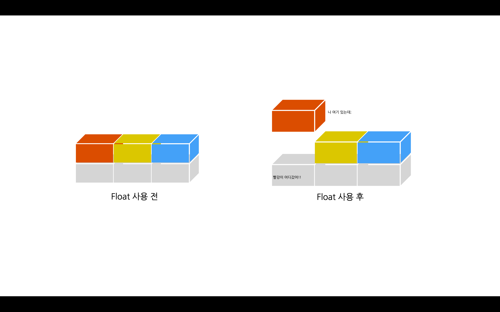
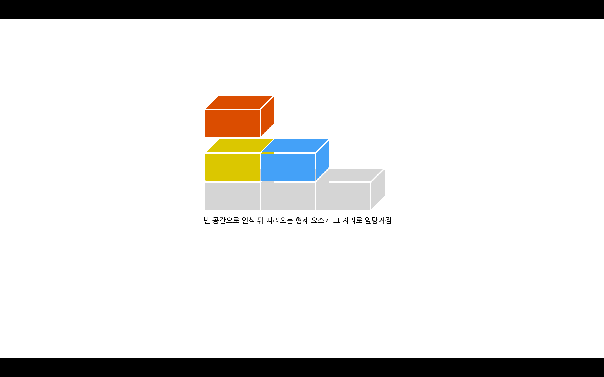

## float
 

float는 블록들을 가로배치 하기 위해 사용합니다

block → 길 막음

float → 길 막힘을 해결해주는 것

길 막힘을 해결해주지만 레이아웃을 엄청나게 망가트립니다 즉, 우리가 만들어 놓은 요소들을 흐트린다는 것입니다

float를 사용하고나면 부모요소는 빨간박스가 집나간 자식으로 생각하게 됩니다

옆에 있는 노랑색,파란색 박스는 빨간박스가 어디 갔는지 도통 모르게되버리게 됩니다

그러니 부모요소는 빨간박스가 있던 자리를 빈 공간으로 인식하게되고 뒤에 따라오는 자식요소인 노랑색,파란색 박스가 앞으로 당겨지게 됩니다

부모요소는 빨간박스 자리를 없애버리게 됩니다