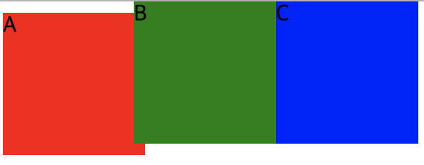
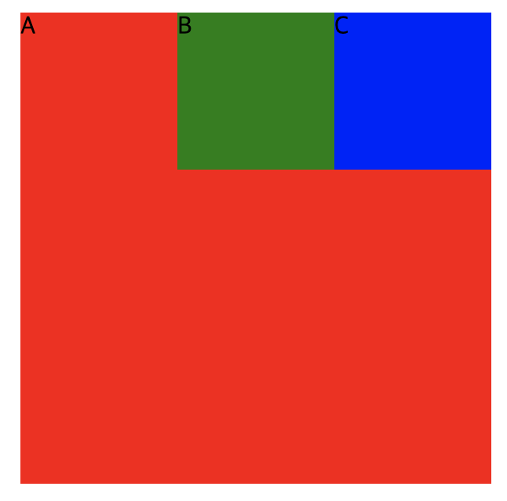

## position-absolute
<br/>

absolute 속성은 static이나 relative와 다르게 바깥 쪽에 공간이 생기지 않습니다 여기서 absolute는 상위 요소인 static 위치를 기준으로 결정됩니다

index.html

```html
<body>
        <div id="a">A</div>
        <div id="b">B</div>
        <div id="c">C</div>
    </body>
```

style.css

```css
div {
    width: 100px;
    height: 100px;
}

#a {
    background-color: red;
    position: static;

}

#b {
    background-color: green;
    position: absolute;
    top: 0px;
    left: 100px;
}

#c {
    background-color: blue;
    position: absolute;
    top: 0px;
    left: 200px;
}
```



relative와 absolute를 응용해보겠습니다

index.html

```html
<body>
        <div id="a">A
            <div id="b">B</div>
            <div id="c">C</div>
        </div>
        
    </body>
```

style.css

```css
div {
    width: 100px;
    height: 100px;
}

#a {
    width: 300px;
    height: 300px;
    background-color: red;
    position: relative;
    top: 100px;
    left: 100px;

}

#b {
    background-color: green;
    position: absolute;
    top: 0px;
    left: 100px;
}

#c {
    background-color: blue;
    position: absolute;
    top: 0px;
    left: 200px;
}
```

relative(a영역) 안에 설정된 absolute (b영역, c영역)은 a영역부터 시작해서 위치가 결정된 것을 볼 수 있습니다

