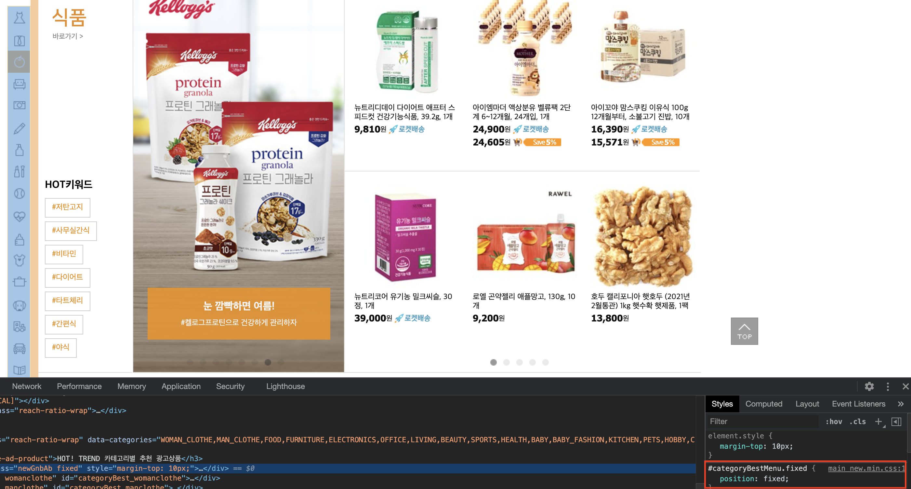

fixed속성은 브라우저 화면의 상대 위치입니다

화면이 바뀌어도 고정된 위치를 설정할 수 있고 상위 요소에 영향을 받지 않습니다

즉 fixed 속성을 사용하여 여러가지 기능 구성이 가능한데 대표적으로 쇼핑몰 사이트 옆을 보면 스크롤을 내릴 때 마다 따라오는 버튼(카카오톡 상담문의 같은거)을 볼 수 있는데요 그게 fixed 속성을 이용한 것입니다

쿠팡 사이트 들어가시면 왼쪽에 따라오는 카테고리가 있습니다 컨트롤+쉬프트+C 해서 가져다대고 확인해보세요



ie7, ie8 브라우저 환경에서는 fixed 속성이 적용되지 않으므로 웹문서 타입을 규정하여 확인해주세요

index.html

```html
<body>
        <div id="a">A</div>
    </body>
```

style.css

```css
body {
    height: 1000rem;
}

#a {
    width: 100%;
    height: 100px;
    background-color: red;
    position: fixed;
```