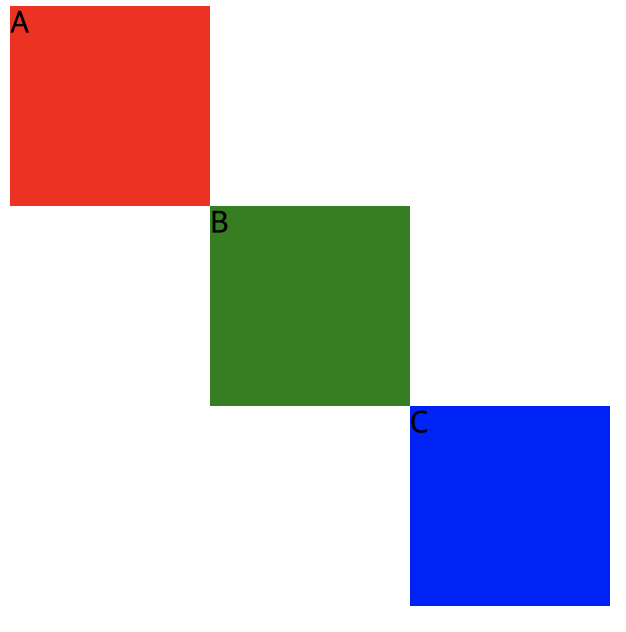

## position-relative
<br/>

relative 속성은 static의 원래 위치부터 계산합니다

top, bottom, left, right의 위치를 같이 설정할 수도 있습니다

각 위치시킨 영역을 확인해보세요

index.html

```html
<body>
        <div id="a">A</div>
        <div id="b">B</div>
        <div id="c">C</div>
    </body>
```

style.css

```css
div {
    width: 100px;
    height: 100px;
}

#a {
    background-color: red;
    position: static;
}

#b {
    background-color: green;
    position: relative;
    top: 0px;
    left: 100px;
}

#c {
    background-color: blue;
    position: relative;
    top: 0px;
    left: 200px;
}
```


