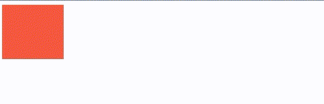

## animation
<br/>

요소에 애니메이션을 설정/제어
<br/>

|값|의미|기본값|
|------|---|---|
|animation-name|@keyframes 규칙의 이름을 지정|none|
|animation-duration|애니메이션의 지속 시간 설정|0s|
|animation-timing-functiion|타이밍 함수 지정|ease|
|animation-delay|애니메이션의 대기 시간 설정|0s|
|animation-iteration-count|애니메이션의 반복 횟수 설정|1|
|animation-direction|애니메이션의 반복 방향 설정|normal|
|animation-fill-mode|애니메이션의 전후 상태(위치) 설정|none|
|animation-play-state|애니메이션의 재생과 정지 설정|running|

<br/>

```html
animation: 애니메이션 이름 지속시간 [타이밍함수 대기시간 반복횟수 반복방향 전후상태 재생/정지];
```

<br/>

```css
.box {
    width: 100px;
    height: 100px;
    background: tomato;
    animation: hello 2s linear infinite both;
}

@keyframes hello {
    0% { width: 200px; }
    100% { width: 50px }
}
```
<br/>
