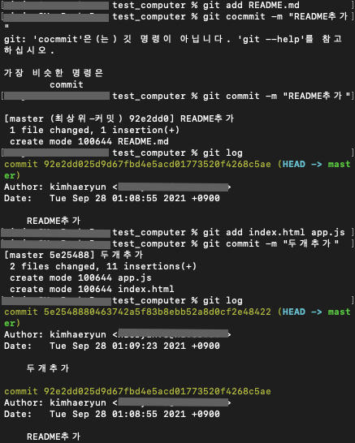

## Git 버전 만들기
 
원하는 파일만 선택하기 
git add README.md
 
 
메세지를 달아 커밋으로 만들기 
git commit -m "프로젝트 설명 파일 추가"
 
 
생성한 커밋 보기 
git log
 
 
vscode를 실행하고 폴더열기를 눌러서 만들어둔 "test-computer"를 불러옵니다 
폴더에 README.md , index.html 파일을 만들어줍니다 
터미널을 실행한 뒤 명령어를 입력합니다 

