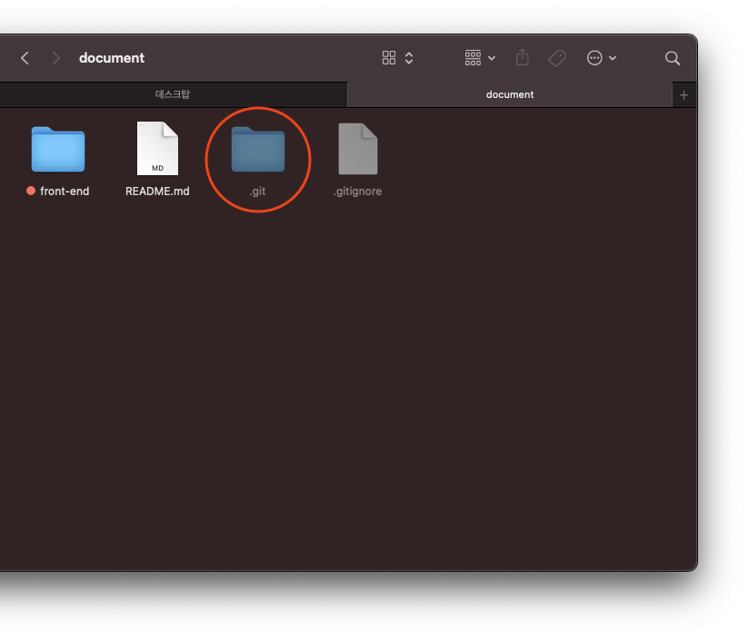
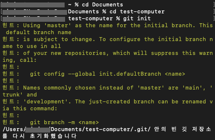

## Git 초기화와 로컬 저장소
 
이 폴더에서 git으로 버전관리를 하고싶을 때, git init을 한다면 무엇이 발생할까요 
기본적으로 숨김처리가 되어있는 로컬저장소인 .git 폴더가 생성됩니다 숨김 파일 보기 옵션을 켜주어야 보이게됩니다 
하지만 이 폴더 안에서 조적하는 것이 아닌 명령어나 프로그램으로 조작하니 따로 숨김 파일을 켜지 않아도 됩니다 
 
순서 
원하는 폴더에서 Git 초기화를 하면 그때부터 사용 - git init 
Git 초기화를 하면 .git이라는 숨겨진 폴더가 만들어집니다 이것을 로컬 저장소라고 부름  
로컬 저장소에 내가 마든 버전 정보, 원격 저장소 주소 등이 저장됩니다 
원격 저장소에서 내 컴퓨터로 코드를 받아오면 로컬 저장소가 자동으로 생깁니다 
한 폴더에 하나의 로컬 저장소만 유지해야 합니다 
  
내 컴퓨터에 test-computer 폴더 생성 
Git Bash로 만든 폴더에 들어가기 
git init으로 로컬 저장소 생성 
 
실습 

문서 폴더에 test-computer 폴더 생성 
cd 명령어를 통해 해당 폴더까지 들어가서 git init 명령어를 입력 

 
폴더에 숨겨진 폴더 .git이 생성된 걸 볼 수 있습니다 
명령어 ls -al 입력 시 숨겨진 폴더, 숨겨진 파일까지 볼 수 있습니다 

