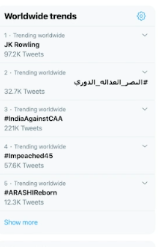
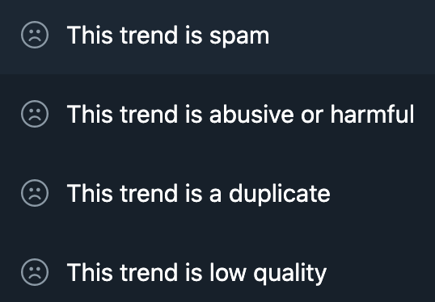

## Aside
<br/>

본문 내용과 직접적으로 연관이 없는 동 떨어진 분리된 내용을 마크업 할 땐 Aside를 사용합니다

배너광고, 사이드 쪽에 주로 사용합니다



heading 태그에는 맨 상단에 보이니 해당 내용을 적어줍니다

```html
<body>
    <aside>
        <h1>
            Worldword trends
        </h1>
    </aside>
</body>
```

heading 옆에 톱니바퀴가 있고 해당 기능을 누르면 modal 창이 뜨게 되므로 버튼 형식으로 만듭니다

```html
<button type="button" aria-label="Options">
<!--icon-->
</button>
```

위 내용들은 첫 상단에 적합하니 <header>으로 감싸줍니다

```html
<body>
    <header>
        <h1>
            Worldword trends
        </h1>
        <button type="button" aria-label="Options">
            <!--icon-->
        </button>
    </header>
</body>
```

리스트 내용을 보면 1 2 3 4 5 순서가 있고 병렬적으로 되어 있으며 글 하나당 모두 링크로 이동됩니다

```html
<body>
    <ol>
        <li>
            <a href="#">
                <span>1 Trending worldwide</span>
                <strong lang="ko">#김민준</strong>
                <span>100K Tweets</span>
            </a>
        </li>
    </ol>
</body>
```



옆에 버튼을 누르는 기능이 있는데요 해당 기능을 누르면 위 이미지 같은 형식이 나오게 됩니다

```html
<body>
    <button type="button" aria-label="Options">
        <!--icon-->
    </button>
    <div>
        <button type="button">
            <!--icon-->
            This trend is spam
        </button>
        <button type="button">
            <!--icon-->
            This trend is abusive or harmful
        </button>
        <button type="button">
            <!--icon-->
            This trend is a duplicate
        </button>
        <button type="button">
            <!--icon-->
            This trend is low quality
        </button>
    </div>
</body>
```

마지막으로 하단부 하는 역할에 foot으로 지정하고 코드만 작성합니다

총 코드

```html
<body>
    <aside>
        <header>
            <h1>
                Worldword trends
            </h1>
            <button type="button" aria-label="Options">
                <!--icon-->
            </button>
        </header>
        <ol>
            <li>
                <button type="button" aria-label="Options">
                    <!--icon-->
                </button>
                <div>
                    <button type="button">
                        <!--icon-->
                        This trend is spam
                    </button>
                    <button type="button">
                        <!--icon-->
                        This trend is abusive or harmful
                    </button>
                    <button type="button">
                        <!--icon-->
                        This trend is a duplicate
                    </button>
                    <button type="button">
                        <!--icon-->
                        This trend is low quality
                    </button>
                </div>
                <a href="#">
                    <span>1 Trending worldwide</span>
                    <strong lang="ko">#김민준</strong>
                    <span>100K Tweets</span>
                </a>
            </li>
            <li>
                <button type="button" aria-label="Options">
                    <!--icon-->
                </button>
                <a href="#">
                    <span>2 Trending worldwide</span>
                    <strong lang="ko">#김민준</strong>
                    <span>100K Tweets</span>
                </a>
            </li>
            <li>
                <button type="button" aria-label="Options">
                    <!--icon-->
                </button>
                <a href="#">
                    <span>3 Trending worldwide</span>
                    <strong lang="ko">#김민준</strong>
                    <span>100K Tweets</span>
                </a>
            </li>
            <li>
                <button type="button" aria-label="Options">
                    <!--icon-->
                </button>
                <a href="#">
                    <span>4 Trending worldwide</span>
                    <strong lang="ko">#김민준</strong>
                    <span>100K Tweets</span>
                </a>
            </li>
            <li>
                <button type="button" aria-label="Options">
                    <!--icon-->
                </button>
                <a href="#">
                    <span>5 Trending worldwide</span>
                    <strong lang="ko">#김민준</strong>
                    <span>100K Tweets</span>
                </a>
            </li>
        </ol>
    </aside>
</body>
```