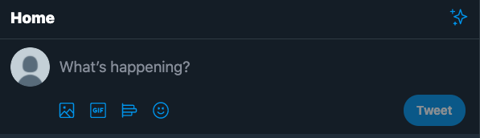
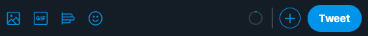
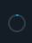

## form-tweet
<br/>




섹션 태그 사용시 반드시 heading 태그를 사용합니다

heading 태그를 사용할 곳이 없다고해도 반드시 적어야합니다

```html
<section>
        <h1>What's happening?</h1>
    </section>
```

아래 4개에 있는 아이콘들은 각각의 다른 기능을 하며 버튼 형식으로 만들어줍니다

검색창 틀을 만들어볼껀데 여긴 form 태그를 사용합니다 동그란 이미지를 누르면 프로필창으로 들어가게되는데 그러므로 a 태그를 사용합니다

```html
<form action="#" method="POST">
        <a href="#">
            minjun
        </a>
    </form>
```

이제 what's happening 부분에 글을 쓰는 기능을 만들껀데 아주 많은 글의 양을 받을 수 있기 때문에 text-area를 사용합니다

글을 쓰기 시작하면 해당 글이 사라지게끔 만들고 트위터가 제약을 걸어놓은 최대 쓸 수 있는 글자량은 280자니까 maxlengh도 사용합니다

```html
<form action="#" method="POST">
        <a href="#"> minjun
            <textarea placeholder="What's happening" maxlength="280"></textarea>
        </a>
    </form>
```

4개의 아이콘 부분을 마크업 할껀데요

첫번째는 클릭하면 파일업로드가 가능하게끔하고 여러 파일을 업로드 할 수 있게 만들어줍니다

```html
<input type="file" multiple />
```

해당 아이콘 기능엔 비디오 파일과 이미지파일만 넣게끔 만들어줘야합니다

전체 이미지를 허용한다고 하면  image/* 값을 넣으면됩니다

```html
<input type="file" multiple accept="video/*, image/*"/>
```

GIF를 누르게되면 modal이 뜨게 되는데 이 부분도 버튼으로 만들어줍니다

```html
<button type="button" aria-label="Seach GIF..">
        <!--icon-->
    </button>
```

옆에 기능도 클릭하면 투표 기능처럼 활성화가 되는데 누르기 위한 기능은 버튼이니까 버튼 형식으로 만듭니다

```html
<button type="button" aria-label="Create a poll ">
        <!--icon-->
    </button>
```



글을 작성할 때 마다 차오르는 칸입니다 단순히 내용을 쳤을 때 차오르는 것 처럼 보일 순 있지만 정보를 담고 있습니다 280자 리미트가 걸려있고 얼마나 작성했는지에 따른 형식이니까 텍스트정보와 다를게 없다고 생각이 듭니다

나중에 javascript 기능을 사용하면 0이 1 2 3 4 5 6 처럼 오르게 만들 수도 있습니다

```html
<strong aria-label="0 out of 280 characters">

    </strong>
```

다음 + 버튼도 눌러보면 modal창이 뜨게되므로 버튼 태그를 사용합니다

```html
<button type="button" aria-label="Add another Tweet">
<!--icon-->
</button>
```