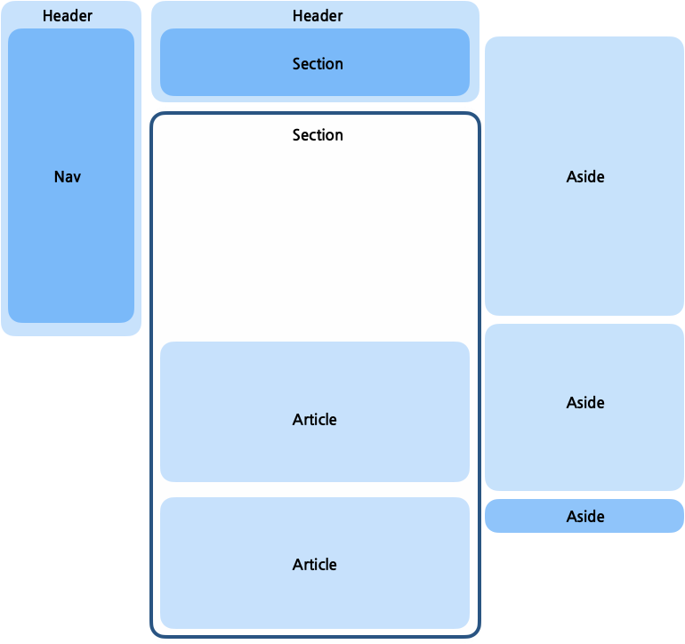

## tweet-code
<br/>



로고

```html
<header>
        <h1>
            <a href="#">
                
            </a>
        </h1>
    </header>
```

다음 메뉴바를 넣어줘야하니 nav를 붙여줍니다

```html
<body>
    <header>
        <h1>
            <a href="#">
                
            </a>
        </h1>
        <nav>
            <h1>Menu</h1>
            <ul>
                <li>
                    <a href="#">
                        <span>Current page</span>
                        <!-- icon -->
                        Home
                    </a>
                </li>
                <li>
                    <a href="#">
                        <!-- icon -->
                        Explore
                    </a>
                </li>
                <li>
                    <a href="#">
                        <strong aria-label="Unread notifications">5</strong>
                        <!-- icon -->
                        Notifications
                    </a>
                </li>
                <li>
                    <a href="#">
                        <!-- icon -->
                        Messages
                    </a>
                </li>
                <li>
                    <a href="#">
                        <!-- icon -->
                        Bookmarks
                    </a>
                </li>
                <li>
                    <a href="#">
                        <!-- icon -->
                        Lists
                    </a>
                </li>
                <li>
                    <a href="#">
                        <!-- icon -->
                        Profile
                    </a>
                </li>
                <li>
                    <button type="button">
                        <!-- icon -->
                        More
                    </button>
                    <!--MENU-->
                </li>
            </ul>
            <button type="button">
                twitter
            </button>
        </nav>
    </header>
</body>
```

여기까지가 왼쪽 헤더 부분에 대한 완성본입니다

다음은 메인파트 입니다 헤더 밑에 작성합니다

```html
<body>
    <header>
        <h1>
            <a href="#">
                
            </a>
        </h1>
        <nav>
            <h1>Menu</h1>
            <ul>
                <li>
                    <a href="#">
                        <span>Current page</span>
                        <!-- icon -->
                        Home
                    </a>
                </li>
                <li>
                    <a href="#">
                        <!-- icon -->
                        Explore
                    </a>
                </li>
                <li>
                    <a href="#">
                        <strong aria-label="Unread notifications">5</strong>
                        <!-- icon -->
                        Notifications
                    </a>
                </li>
                <li>
                    <a href="#">
                        <!-- icon -->
                        Messages
                    </a>
                </li>
                <li>
                    <a href="#">
                        <!-- icon -->
                        Bookmarks
                    </a>
                </li>
                <li>
                    <a href="#">
                        <!-- icon -->
                        Lists
                    </a>
                </li>
                <li>
                    <a href="#">
                        <!-- icon -->
                        Profile
                    </a>
                </li>
                <li>
                    <button type="button">
                        <!-- icon -->
                        More
                    </button>
                    <!--MENU-->
                </li>
            </ul>
            <button type="button">
                twitter
            </button>
        </nav>
    </header>

    <main>
        <header>
            <h1>HOME</h1>
            <button type="button" aria-label="timeline options">
                <!--icon-->
            </button>
            <div>
                <h2>Home shows you top Tweets first</h2>
                <button type="button">
                    <!--icon-->
                    <strong>
                        See latest Tweets instead
                    </strong>
                    <span>
                        You’ll be switched back Home after you’ve been away for a while.
                    </span>
                </button>
                <a href="#">
                    <!--icon-->
                    View content preferences
                </a>
            </div>
        </header>
    </main>
</body>
```

검색 폼 부분을 넣어줘야합니다 (100번 째 줄 헤더 아래)

```html
<body>
    <header>
        <h1>
            <a href="#">
                
            </a>
        </h1>
        <nav>
            <h1>Menu</h1>
            <ul>
                <li>
                    <a href="#">
                        <span>Current page</span>
                        <!-- icon -->
                        Home
                    </a>
                </li>
                <li>
                    <a href="#">
                        <!-- icon -->
                        Explore
                    </a>
                </li>
                <li>
                    <a href="#">
                        <strong aria-label="Unread notifications">5</strong>
                        <!-- icon -->
                        Notifications
                    </a>
                </li>
                <li>
                    <a href="#">
                        <!-- icon -->
                        Messages
                    </a>
                </li>
                <li>
                    <a href="#">
                        <!-- icon -->
                        Bookmarks
                    </a>
                </li>
                <li>
                    <a href="#">
                        <!-- icon -->
                        Lists
                    </a>
                </li>
                <li>
                    <a href="#">
                        <!-- icon -->
                        Profile
                    </a>
                </li>
                <li>
                    <button type="button">
                        <!-- icon -->
                        More
                    </button>
                    <!--MENU-->
                </li>
            </ul>
            <button type="button">
                twitter
            </button>
        </nav>
    </header>

    <main>
        <header>
            <h1>HOME</h1>
            <button type="button" aria-label="timeline options">
                <!--icon-->
            </button>
            <div>
                <h2>Home shows you top Tweets first</h2>
                <button type="button">
                    <!--icon-->
                    <strong>
                        See latest Tweets instead
                    </strong>
                    <span>
                        You’ll be switched back Home after you’ve been away for a while.
                    </span>
                </button>
                <a href="#">
                    <!--icon-->
                    View content preferences
                </a>
            </div>
        </header>

        <section>
            <h1>What's happening?</h1>
            <form action="#" method="POST">
                <a href="#"> haelyun
                    <textarea placeholder="What's happening" maxlength="280"></textarea>
                </a>
                <button type="button" aria-label="Upload files">
                    <!--icon-->
                </button>
                <input type="file" multiple accept="video /*, image/*" />
                <button type="button" aria-label="Seach GIF..">
                    <!--icon-->
                </button>
                <button type="button" aria-label="Create a poll">
                    <!--icon-->
                </button>
                <button type="button" aria-label="Choose emoji">
                    <!--icon-->
                </button>
                <strong aria-label="0 out of 280 characters">
                </strong>
                <button type="button" aria-label="Add another Tweet">
                    <!--icon-->
                </button>
                <button type="submit">Tweet</button>
            </form>
        </section>
    </main>
</body>
```

다음은 트위터 검색 폼 section 다음 부분에 넣습니다

```html
<body>
    <header>
        <h1>
            <a href="#">
                
            </a>
        </h1>
        <nav>
            <h1>Menu</h1>
            <ul>
                <li>
                    <a href="#">
                        <span>Current page</span>
                        <!-- icon -->
                        Home
                    </a>
                </li>
                <li>
                    <a href="#">
                        <!-- icon -->
                        Explore
                    </a>
                </li>
                <li>
                    <a href="#">
                        <strong aria-label="Unread notifications">5</strong>
                        <!-- icon -->
                        Notifications
                    </a>
                </li>
                <li>
                    <a href="#">
                        <!-- icon -->
                        Messages
                    </a>
                </li>
                <li>
                    <a href="#">
                        <!-- icon -->
                        Bookmarks
                    </a>
                </li>
                <li>
                    <a href="#">
                        <!-- icon -->
                        Lists
                    </a>
                </li>
                <li>
                    <a href="#">
                        <!-- icon -->
                        Profile
                    </a>
                </li>
                <li>
                    <button type="button">
                        <!-- icon -->
                        More
                    </button>
                    <!--MENU-->
                </li>
            </ul>
            <button type="button">
                twitter
            </button>
        </nav>
    </header>

    <main>
        <header>
            <h1>HOME</h1>
            <button type="button" aria-label="timeline options">
                <!--icon-->
            </button>
            <div>
                <h2>Home shows you top Tweets first</h2>
                <button type="button">
                    <!--icon-->
                    <strong>
                        See latest Tweets instead
                    </strong>
                    <span>
                        You’ll be switched back Home after you’ve been away for a while.
                    </span>
                </button>
                <a href="#">
                    <!--icon-->
                    View content preferences
                </a>
            </div>
        </header>

        <section>
            <h1>What's happening?</h1>
            <form action="#" method="POST">
                <a href="#"> haelyun
                    <textarea placeholder="What's happening" maxlength="280"></textarea>
                </a>
                <button type="button" aria-label="Upload files">
                    <!--icon-->
                </button>
                <input type="file" multiple accept="video /*, image/*" />
                <button type="button" aria-label="Seach GIF..">
                    <!--icon-->
                </button>
                <button type="button" aria-label="Create a poll">
                    <!--icon-->
                </button>
                <button type="button" aria-label="Choose emoji">
                    <!--icon-->
                </button>
                <strong aria-label="0 out of 280 characters">
                </strong>
                <button type="button" aria-label="Add another Tweet">
                    <!--icon-->
                </button>
                <button type="submit">Tweet</button>
            </form>
        </section>
        <section>
            <h1>Your Timelink</h1>
            <ol>
                <li>
                    <!-- Tweet -->
                </li>
            </ol>
        </section>
    </main>
</body>
```

Tweet 적은 부분에 붙여넣기를 합니다 붙혀넣은 article 부분을 총 5개 붙여넣습니다

총 코드

```html
<body>
    <header>
        <h1>
            <a href="#">
                
            </a>
        </h1>
        <nav>
            <h1>Menu</h1>
            <ul>
                <li>
                    <a href="#">
                        <span>Current page</span>
                        <!-- icon -->
                        Home
                    </a>
                </li>
                <li>
                    <a href="#">
                        <!-- icon -->
                        Explore
                    </a>
                </li>
                <li>
                    <a href="#">
                        <strong aria-label="Unread notifications">5</strong>
                        <!-- icon -->
                        Notifications
                    </a>
                </li>
                <li>
                    <a href="#">
                        <!-- icon -->
                        Messages
                    </a>
                </li>
                <li>
                    <a href="#">
                        <!-- icon -->
                        Bookmarks
                    </a>
                </li>
                <li>
                    <a href="#">
                        <!-- icon -->
                        Lists
                    </a>
                </li>
                <li>
                    <a href="#">
                        <!-- icon -->
                        Profile
                    </a>
                </li>
                <li>
                    <button type="button">
                        <!-- icon -->
                        More
                    </button>
                    <!--MENU-->
                </li>
            </ul>
            <button type="button">
                twitter
            </button>
        </nav>
    </header>

    <main>
        <header>
            <h1>HOME</h1>
            <button type="button" aria-label="timeline options">
                <!--icon-->
            </button>
            <div>
                <h2>Home shows you top Tweets first</h2>
                <button type="button">
                    <!--icon-->
                    <strong>
                        See latest Tweets instead
                    </strong>
                    <span>
                        You’ll be switched back Home after you’ve been away for a while.
                    </span>
                </button>
                <a href="#">
                    <!--icon-->
                    View content preferences
                </a>
            </div>
        </header>

        <section>
            <h1>What's happening?</h1>
            <form action="#" method="POST">
                <a href="#"> haelyun
                    <textarea placeholder="What's happening" maxlength="280"></textarea>
                </a>
                <button type="button" aria-label="Upload files">
                    <!--icon-->
                </button>
                <input type="file" multiple accept="video /*, image/*" />
                <button type="button" aria-label="Seach GIF..">
                    <!--icon-->
                </button>
                <button type="button" aria-label="Create a poll">
                    <!--icon-->
                </button>
                <button type="button" aria-label="Choose emoji">
                    <!--icon-->
                </button>
                <strong aria-label="0 out of 280 characters">
                </strong>
                <button type="button" aria-label="Add another Tweet">
                    <!--icon-->
                </button>
                <button type="submit">Tweet</button>
            </form>
        </section>
        <section>
            <h1>Your Timelink</h1>
            <ol>
                <li>
                    <article>
                        <h1>A Tweet form 김익명</h1>
                        <header>
                            <a href="#">
                                
                            </a>
                            <h2>
                                <a href="#">
                                    김익명
                                </a>
                            </h2>
                            <dl>
                                <div>
                                    <dt>Username</dt>
                                    <dd>
                                        <a href="#">
                                            @anonymouskim
                                        </a>
                                    </dd>
                                </div>
                                <div>
                                    <dt>Posted</dt>
                                    <dd>
                                        <a href="#">
                                            Dec 19
                                        </a>
                                    </dd>
                                </div>
                            </dl>
                            <button type="button" aria-label="Options">
                                <!--icon-->
                            </button>
                            <div>
                                <button type="button">
                                    <!--icon-->
                                    Show less often
                                </button>
                                <button type="button">
                                    <!--icon-->
                                    Embed Tweet
                                </button>
                                <button type="button">
                                    <!--icon-->
                                    Unfollow @anonymouskim
                                </button>
                                <button type="button">
                                    <!--icon-->
                                    Block @anonymouskim
                                </button>
                                <button type="button">
                                    <!--icon-->
                                    Report Tweet
                                </button>
                            </div>
                        </header>
                        <p>
                            영어를 더 잘 하고싶다. 그러나 공부를 하고 싶지는 않다. 내 삶의 모든 것이 이런 식으로 망해왔다
                        </p>
                        <footer>
                            <button type="button">
                                <span class="sr-only">Tweet your reply</span>
                                <strong aria-label="4 replied">4</strong>
                            </button>
                            <button type="button">
                                <span class="sr-only">Retweet</span>
                                <strong aria-label="2 retweeted">2</strong>
                            </button>
                            <div>
                                <button type="button">
                                    Retweet
                                </button>
                                <button type="button">
                                    Retweet with comment
                                </button>
                            </div>
                            <button type="button">
                                <span class="sr-only">Like this tweet</span>
                                <strong aria-label="27 liked">100</strong>
                            </button>
                            <button type="button">
                                <span class="sr-only">share</span>
                            </button>
                            <div>
                                <button type="button">
                                    Send via Direct Message
                                </button>
                                <button type="button">
                                    Add Tweet to Bookmarks
                                </button>
                                <button type="button">
                                    Copy link to Tweet
                                </button>
                            </div>
                        </footer>
                    </article>
                    <article>
                        <h1>A Tweet form 김익명</h1>
                        <header>
                            <a href="#">
                                
                            </a>
                            <h2>
                                <a href="#">
                                    김익명
                                </a>
                            </h2>
                            <dl>
                                <div>
                                    <dt>Username</dt>
                                    <dd>
                                        <a href="#">
                                            @anonymouskim
                                        </a>
                                    </dd>
                                </div>
                                <div>
                                    <dt>Posted</dt>
                                    <dd>
                                        <a href="#">
                                            Dec 19
                                        </a>
                                    </dd>
                                </div>
                            </dl>
                            <button type="button" aria-label="Options">
                                <!--icon-->
                            </button>
                            <div>
                                <button type="button">
                                    <!--icon-->
                                    Show less often
                                </button>
                                <button type="button">
                                    <!--icon-->
                                    Embed Tweet
                                </button>
                                <button type="button">
                                    <!--icon-->
                                    Unfollow @anonymouskim
                                </button>
                                <button type="button">
                                    <!--icon-->
                                    Block @anonymouskim
                                </button>
                                <button type="button">
                                    <!--icon-->
                                    Report Tweet
                                </button>
                            </div>
                        </header>
                        <p>
                            영어를 더 잘 하고싶다. 그러나 공부를 하고 싶지는 않다. 내 삶의 모든 것이 이런 식으로 망해왔다
                        </p>
                        <footer>
                            <button type="button">
                                <span class="sr-only">Tweet your reply</span>
                                <strong aria-label="4 replied">4</strong>
                            </button>
                            <button type="button">
                                <span class="sr-only">Retweet</span>
                                <strong aria-label="2 retweeted">2</strong>
                            </button>
                            <div>
                                <button type="button">
                                    Retweet
                                </button>
                                <button type="button">
                                    Retweet with comment
                                </button>
                            </div>
                            <button type="button">
                                <span class="sr-only">Like this tweet</span>
                                <strong aria-label="27 liked">100</strong>
                            </button>
                            <button type="button">
                                <span class="sr-only">share</span>
                            </button>
                            <div>
                                <button type="button">
                                    Send via Direct Message
                                </button>
                                <button type="button">
                                    Add Tweet to Bookmarks
                                </button>
                                <button type="button">
                                    Copy link to Tweet
                                </button>
                            </div>
                        </footer>
                    </article>
                    <article>
                        <h1>A Tweet form 김익명</h1>
                        <header>
                            <a href="#">
                                
                            </a>
                            <h2>
                                <a href="#">
                                    김익명
                                </a>
                            </h2>
                            <dl>
                                <div>
                                    <dt>Username</dt>
                                    <dd>
                                        <a href="#">
                                            @anonymouskim
                                        </a>
                                    </dd>
                                </div>
                                <div>
                                    <dt>Posted</dt>
                                    <dd>
                                        <a href="#">
                                            Dec 19
                                        </a>
                                    </dd>
                                </div>
                            </dl>
                            <button type="button" aria-label="Options">
                                <!--icon-->
                            </button>
                            <div>
                                <button type="button">
                                    <!--icon-->
                                    Show less often
                                </button>
                                <button type="button">
                                    <!--icon-->
                                    Embed Tweet
                                </button>
                                <button type="button">
                                    <!--icon-->
                                    Unfollow @anonymouskim
                                </button>
                                <button type="button">
                                    <!--icon-->
                                    Block @anonymouskim
                                </button>
                                <button type="button">
                                    <!--icon-->
                                    Report Tweet
                                </button>
                            </div>
                        </header>
                        <p>
                            영어를 더 잘 하고싶다. 그러나 공부를 하고 싶지는 않다. 내 삶의 모든 것이 이런 식으로 망해왔다
                        </p>
                        <footer>
                            <button type="button">
                                <span class="sr-only">Tweet your reply</span>
                                <strong aria-label="4 replied">4</strong>
                            </button>
                            <button type="button">
                                <span class="sr-only">Retweet</span>
                                <strong aria-label="2 retweeted">2</strong>
                            </button>
                            <div>
                                <button type="button">
                                    Retweet
                                </button>
                                <button type="button">
                                    Retweet with comment
                                </button>
                            </div>
                            <button type="button">
                                <span class="sr-only">Like this tweet</span>
                                <strong aria-label="27 liked">100</strong>
                            </button>
                            <button type="button">
                                <span class="sr-only">share</span>
                            </button>
                            <div>
                                <button type="button">
                                    Send via Direct Message
                                </button>
                                <button type="button">
                                    Add Tweet to Bookmarks
                                </button>
                                <button type="button">
                                    Copy link to Tweet
                                </button>
                            </div>
                        </footer>
                    </article>
                    <article>
                        <h1>A Tweet form 김익명</h1>
                        <header>
                            <a href="#">
                                
                            </a>
                            <h2>
                                <a href="#">
                                    김익명
                                </a>
                            </h2>
                            <dl>
                                <div>
                                    <dt>Username</dt>
                                    <dd>
                                        <a href="#">
                                            @anonymouskim
                                        </a>
                                    </dd>
                                </div>
                                <div>
                                    <dt>Posted</dt>
                                    <dd>
                                        <a href="#">
                                            Dec 19
                                        </a>
                                    </dd>
                                </div>
                            </dl>
                            <button type="button" aria-label="Options">
                                <!--icon-->
                            </button>
                            <div>
                                <button type="button">
                                    <!--icon-->
                                    Show less often
                                </button>
                                <button type="button">
                                    <!--icon-->
                                    Embed Tweet
                                </button>
                                <button type="button">
                                    <!--icon-->
                                    Unfollow @anonymouskim
                                </button>
                                <button type="button">
                                    <!--icon-->
                                    Block @anonymouskim
                                </button>
                                <button type="button">
                                    <!--icon-->
                                    Report Tweet
                                </button>
                            </div>
                        </header>
                        <p>
                            영어를 더 잘 하고싶다. 그러나 공부를 하고 싶지는 않다. 내 삶의 모든 것이 이런 식으로 망해왔다
                        </p>
                        <footer>
                            <button type="button">
                                <span class="sr-only">Tweet your reply</span>
                                <strong aria-label="4 replied">4</strong>
                            </button>
                            <button type="button">
                                <span class="sr-only">Retweet</span>
                                <strong aria-label="2 retweeted">2</strong>
                            </button>
                            <div>
                                <button type="button">
                                    Retweet
                                </button>
                                <button type="button">
                                    Retweet with comment
                                </button>
                            </div>
                            <button type="button">
                                <span class="sr-only">Like this tweet</span>
                                <strong aria-label="27 liked">100</strong>
                            </button>
                            <button type="button">
                                <span class="sr-only">share</span>
                            </button>
                            <div>
                                <button type="button">
                                    Send via Direct Message
                                </button>
                                <button type="button">
                                    Add Tweet to Bookmarks
                                </button>
                                <button type="button">
                                    Copy link to Tweet
                                </button>
                            </div>
                        </footer>
                    </article>
                    <article>
                        <h1>A Tweet form 김익명</h1>
                        <header>
                            <a href="#">
                                
                            </a>
                            <h2>
                                <a href="#">
                                    김익명
                                </a>
                            </h2>
                            <dl>
                                <div>
                                    <dt>Username</dt>
                                    <dd>
                                        <a href="#">
                                            @anonymouskim
                                        </a>
                                    </dd>
                                </div>
                                <div>
                                    <dt>Posted</dt>
                                    <dd>
                                        <a href="#">
                                            Dec 19
                                        </a>
                                    </dd>
                                </div>
                            </dl>
                            <button type="button" aria-label="Options">
                                <!--icon-->
                            </button>
                            <div>
                                <button type="button">
                                    <!--icon-->
                                    Show less often
                                </button>
                                <button type="button">
                                    <!--icon-->
                                    Embed Tweet
                                </button>
                                <button type="button">
                                    <!--icon-->
                                    Unfollow @anonymouskim
                                </button>
                                <button type="button">
                                    <!--icon-->
                                    Block @anonymouskim
                                </button>
                                <button type="button">
                                    <!--icon-->
                                    Report Tweet
                                </button>
                            </div>
                        </header>
                        <p>
                            영어를 더 잘 하고싶다. 그러나 공부를 하고 싶지는 않다. 내 삶의 모든 것이 이런 식으로 망해왔다
                        </p>
                        <footer>
                            <button type="button">
                                <span class="sr-only">Tweet your reply</span>
                                <strong aria-label="4 replied">4</strong>
                            </button>
                            <button type="button">
                                <span class="sr-only">Retweet</span>
                                <strong aria-label="2 retweeted">2</strong>
                            </button>
                            <div>
                                <button type="button">
                                    Retweet
                                </button>
                                <button type="button">
                                    Retweet with comment
                                </button>
                            </div>
                            <button type="button">
                                <span class="sr-only">Like this tweet</span>
                                <strong aria-label="27 liked">100</strong>
                            </button>
                            <button type="button">
                                <span class="sr-only">share</span>
                            </button>
                            <div>
                                <button type="button">
                                    Send via Direct Message
                                </button>
                                <button type="button">
                                    Add Tweet to Bookmarks
                                </button>
                                <button type="button">
                                    Copy link to Tweet
                                </button>
                            </div>
                        </footer>
                    </article>
                </li>
            </ol>
        </section>
    </main>
</body>
```